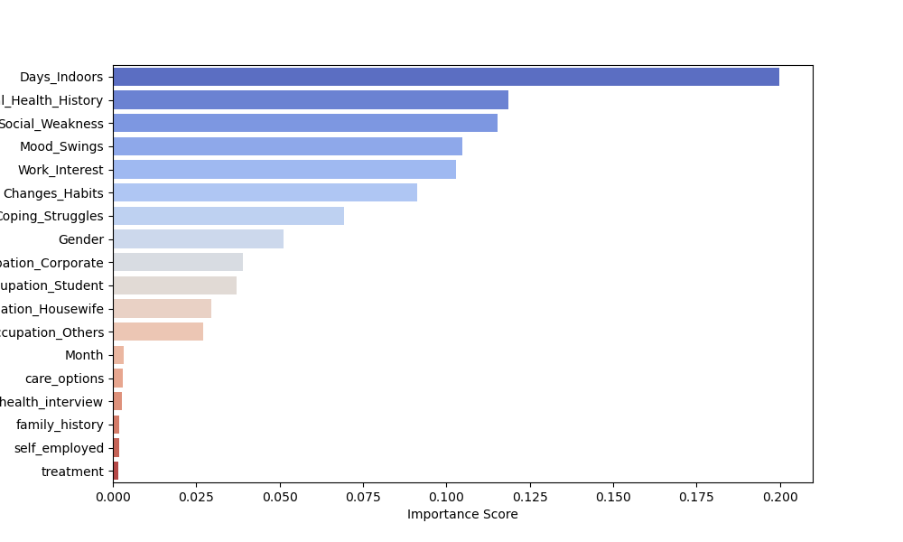
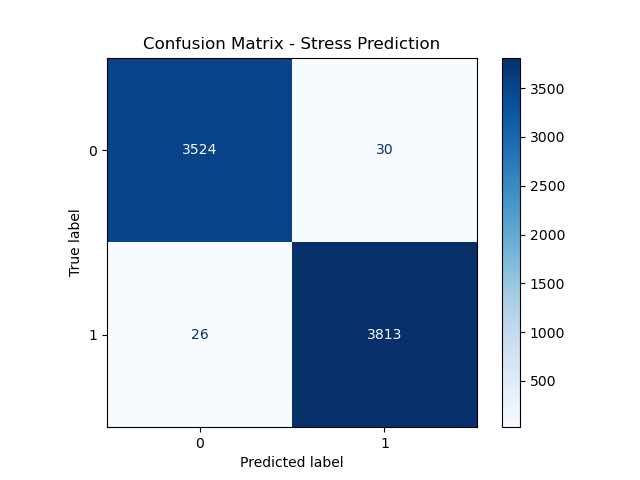
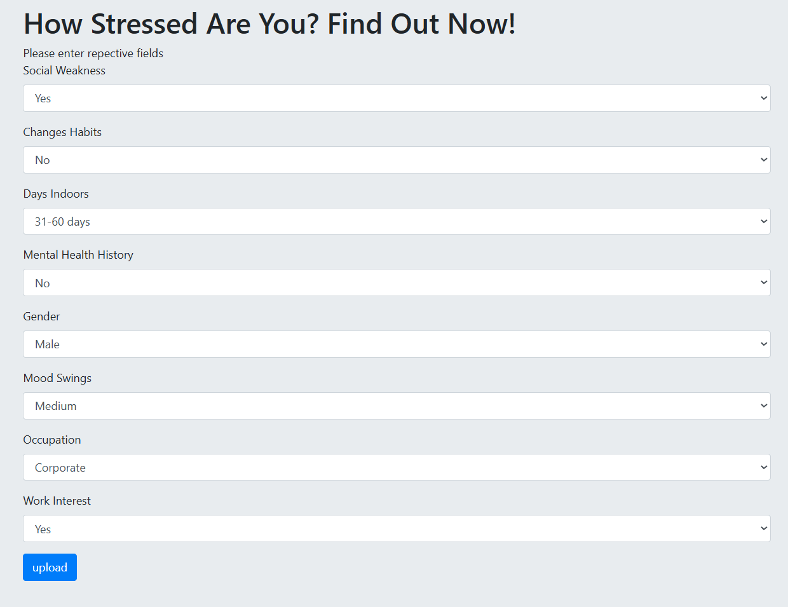

This project focuses on developing a machine learning model to predict growing stress levels using a global mental health dataset. The model utilizes a Decision Tree classifier, known for its interpretability and accuracy. The project includes the following steps:

1- **Data Collection**: The dataset is sourced from Kaggle's Mental Health Dataset. It includes variables related to stress, depression, anxiety levels, well-being, demographics (such as gender, employment status, region), and use of mental health services.

2- **Data Preprocessing**: The dataset undergoes cleaning, including handling missing values and encoding categorical variables. These steps ensure data quality and compatibility with machine learning models.

3- **Univariate and Bivariate Analysis**: Visualizations such as histograms and pair plots are used to explore individual features and relationships between variables. This analysis provides statistical insights into stress predictors.

4- **Feature Selection**: Feature selection techniques are applied to identify the most impactful variables. 

5- **Model**: Comparative Methods: Multiple machine learning models including Logistic Regression, SVM, Naive Bayes, K-Nearest Neighbors, and Decision Tree are trained and evaluated.
The Decision Tree classifier is chosen as the final model due to its strong performance and interpretability. The model achieves a 99% F1-score, indicating excellent classification capability.

6- **Model Evaluation**: The model's performance is evaluated using a confusion matrix and key metrics like precision, recall, and F1-score. These metrics confirm the model’s ability to accurately predict individuals experiencing growing stress.
                                                           

    

---

## Dataset Overview

- **Source**: [Kaggle - Mental Health Dataset](https://www.kaggle.com/datasets/divaniazzahra/mental-health-dataset)
- **Goal**: Predict individuals experiencing growing stress
- **Variables**: Includes stress, depression, anxiety levels, well-being, demographics (gender, employment status, region), and use of mental health services
- **Type**: Survey-based global dataset

---

## Objective

- Understand trends in global mental health
- Predict **stress level growth** using ML classification techniques
- Provide actionable insights from data analysis to support mental health awareness

---

## Feature Selection Visualization

Below is a visual summary of the feature selection techniques used in this project:

## Model Performance

- **Model**: Decision Tree Classifier  
- **Evaluation Metric**: F1 Score  
- **Achieved**: ⭐ **99% F1 Score**

The confusion matrix below shows the model's performance:

---

## Deployment

